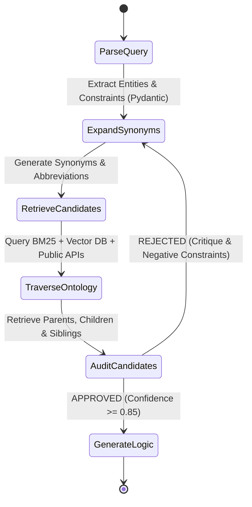

# Clinical Cohort Mapper: Consensus-Driven Graph Reflexion (CDGR) Architecture

This document outlines the system architecture for a high-precision, self-correcting clinical concept mapping system. It evaluates the proposed agentic design patterns and details a unified hybrid architecture—the **Consensus-Driven Graph Reflexion (CDGR)** pipeline.

---

## 1. Evaluation & Synthesis of Agentic Design Patterns

To achieve near-perfect precision in clinical cohort mapping, we analyze three distinct agentic design patterns:

1.  **The "Medical Board Consensus" (Multi-Agent Loop)**:
    *   *Strength*: Strong separation of concerns. The Auditor agent acts as an independent validator, reducing confirmation bias inherent in single-agent chains.
    *   *Limitation*: High token latency and potential infinite disagreement loops if the transition criteria are not strictly defined.
2.  **The "Graph-Traversing Reflexion" (Ontology Navigation)**:
    *   *Strength*: Extremely effective for precision. Clinical vocabularies (e.g., SNOMED, ICD-10, RxNorm) are structured hierarchically. Navigating parent-child-sibling relationships programmatically resolves granularity issues (e.g., stage 3 vs unspecified CKD).
    *   *Limitation*: Requires local representation of vocabulary hierarchies or high-speed access to graph-traversal APIs (like RxNav or UMLS UTS).
3.  **The "Grammar-Enforced Code Critic" (Structured Generation)**:
    *   *Strength*: Eliminates formatting and schema hallucinations. Guarantees that the parsed constraints (operators, values, units) are represented in strict data models.
    *   *Limitation*: Purely syntax-focused; syntax validation does not guarantee clinical accuracy (e.g., mapping to a valid but clinically incorrect drug class).

### The Solution: Consensus-Driven Graph Reflexion (CDGR)
Rather than picking a single pattern, the CDGR architecture **integrates all three**:
*   We use **Grammar-Enforced Parsing** (via Pydantic schemas) to structure the query constraints.
*   We run a **Multi-Agent Consensus Loop** separating the clinical analysis (Linguist), retrieval (Informatics), and validation (Auditor).
*   We empower the **Auditor Agent** to perform **Graph-Traversing Reflexion** to verify and self-correct candidate specificity before final selection.

---

## 2. CDGR Pipeline State Machine

The workflow is modeled as a state machine. If the *Clinical Auditor* rejects the candidates or logic, it transitions back to the *Linguist* with structured critiques to trigger self-correction.



---

## 3. Core Multi-Agent Specs

### Agent 1: Medical Linguist (Extraction & Expansion)
*   **Role**: Deconstruct the free-form query into standard clinical components and expand terminology.
*   **Input**: Natural language query + (Optional) critique from the Auditor.
*   **Output**: Structured JSON following the Pydantic schema below:
    ```python
    class ClinicalIntent(BaseModel):
        original_query: str
        clinical_entities: List[str]      # e.g., ["HbA1c", "glycated hemoglobin"]
        synonyms: List[str]               # Expanded terms
        domain: Literal["measurement", "condition", "drug", "procedure", "observation"]
        constraint: Optional[Constraint]  # operator, value, unit
        status: Literal["current", "prior", "any"]
        negative_constraints: List[str]   # Terms to explicitly avoid (populated on retry)
    ```

### Agent 2: Medical Informatician (Hybrid Retrieval)
*   **Role**: Map the parsed entities and synonyms to standard terminology candidate pools.
*   **Search Mechanics**:
    1.  **Lexical (FTS5 / BM25)**: Query local SQLite vocabulary database for exact display and synonym matches.
    2.  **Vector DB (Chroma/Qdrant)**: Compute embeddings for the query terms and fetch top-K matches to capture conceptual equivalents (e.g., "kidney failure" $\rightarrow$ "renal failure").
    3.  **External APIs**: Query RxNav API (for RxNorm drug hierarchies) and LOINC/UMLS UTS REST APIs for real-time validation.

### Agent 3: Clinical Auditor (Ontology Reflexion & Critic)
*   **Role**: Evaluate candidates, traverse relationship graphs, and either approve or reject the candidate pool.
*   **Ontology Reflexion Algorithm**:
    1.  **Domain Check**: Ensure candidates match the target vocabulary (LOINC for measurements, RxNorm for drugs, ICD-10-CM/SNOMED for conditions).
    2.  **Hierarchical Expansion**:
        *   Retrieve the parent concepts of the candidate. If the query specified details not present in the parent (e.g., "stage 3" is in the query, but candidate parent is "unspecified CKD"), flag it.
        *   Query child and sibling concepts. Compare their names against the query. If a sibling matches a modifier (e.g., "stage 3a" `N18.31` vs "stage 3b` `N18.32`), include both and mark them as specific child targets.
    3.  **Auditor Decision**:
        *   *If valid*: Approve and rank candidates, calculating a weighted confidence score based on lexical matching, vector distance, and hierarchy matching.
        *   *If invalid (mismatch/hallucination)*: Return a structured rejection critique (e.g., `{"status": "rejected", "reason": "Candidate E11 is a Condition but domain is Measurement", "suggested_exclusions": ["diabetes mellitus"]}`).

---

## 4. Example Self-Correction Walkthrough

### Query: *"Patients with chronic kidney disease stage 3"*

#### **Iteration 1**
1.  **Medical Linguist**:
    *   Entity: `chronic kidney disease stage 3`
    *   Domain: `condition`
    *   Synonyms: `["CKD stage 3", "chronic renal failure stage 3"]`
2.  **Medical Informatician**:
    *   Retrieves candidate codes:
        *   `N18.9` - *Chronic kidney disease, unspecified* (Score: 0.92)
        *   `N18.30` - *Chronic kidney disease, stage 3 unspecified* (Score: 0.88)
3.  **Clinical Auditor (Reflexion)**:
    *   *Review*: Checks `N18.9`. Identifies that its parent/concept node is too broad because the query explicitly specifies "stage 3".
    *   *Action*: Rejects `N18.9`. Notices `N18.30` contains "stage 3". Retrieves child/sibling concepts of `N18.3` using the ontology graph: `N18.31` (*CKD stage 3a*) and `N18.32` (*CKD stage 3b*).
    *   *Self-Correction*: Rewrites the candidate selection to include `N18.30`, `N18.31`, and `N18.32`, assigning high confidence to `N18.30` as the direct stage-level mapping and secondary confidence to the specific subtypes.

---

## 5. Development Roadmap & Verification

1.  **Phase 1: Environment Setup & SQLite Local Vocab Database**
    *   Pre-populate a lightweight SQLite database with mapped relationships between sample terms (LOINC, RxNorm, SNOMED, ICD-10-CM) to avoid high external API latency during iterative loops.
2.  **Phase 2: Agent Framework Implementation**
    *   Build the agent state loop using a lightweight state-machine engine (e.g., simple Python dict-based state routers or LangGraph).
3.  **Phase 3: Automated Test Suite**
    *   Implement `tests/test_mapper.py` targeting all 20 sample queries. Assert that the output adheres to the example schema and that confidence rankings align with clinician expectations.

---

## 6. A2A Protocol & OpenTelemetry Observability

Implementing a multi-agent system with iterative self-correction loops introduces execution tracing complexity. Integrating **OpenTelemetry (OTel)** alongside the **Agent-to-Agent (A2A) protocol** provides observability into the CDGR pipeline.

### A. Trace Context Propagation
Each cohort query initiates a root trace. Since our agents (Linguist, Informatician, Auditor) execute distinct, decoupled operations—potentially running asynchronously or across separate network boundaries—the A2A protocol propagates context using standard W3C Trace Context headers (`traceparent`, `tracestate`):

```text
MapClinicalQuery (Root Span)  [==================================================] (145ms)
  ├── Linguist.extract_intent  [====] (12ms)
  ├── Informatician.retrieve   [==========] (30ms)
  └── Auditor.validate_codes                 [============================] (95ms)
        ├── DB.get_concept_relations   [==] (5ms)
        └── Refinement.loop_iteration_1           [==================] (85ms)
              ├── Linguist.re_extract      [===] (10ms)
              └── Informatician.retrieve   [====] (12ms)
```

### B. Custom Telemetry Attributes
Custom metadata tags are injected into spans to assist in debugging precision issues and tracking search heuristics:
*   `clinical.query`: The raw natural language search string.
*   `clinical.domain`: The routed category (`measurement`, `drug`, `condition`, etc.).
*   `clinical.correction_count`: The number of self-correction loop iterations triggered before resolution.
*   `clinical.rejected_codes`: List of vocabulary codes rejected during the verification step.
*   `clinical.final_precision_score`: The confidence score assigned to the selected candidate.

### C. System Health Metrics
Operational metrics are monitored using OTel instruments to detect pipeline drift and API degradation:
1.  **Self-Correction Activation Rate**: Track the percentage of queries triggering the retry loop. A rising rate indicates lexical parsing decay or outdated terminology mappings.
2.  **Vocabulary Latency (P95/P99)**: Profile external API calls (e.g. RxNav, UMLS) to detect rate-limiting (429 errors) or high response latencies.
3.  **Rejection Rule Density**: Measure which specific safety rules are discarding candidates most frequently. This verifies that filtering criteria remain balanced (i.e. preventing over-filtering that degrades recall).

---

## 7. Clinical & System Edge Cases

Designing for clinical cohort mapping requires mitigating complex edge cases where semantic intent and standard terminologies diverge:

### A. Infinite Loops in Self-Correction
*   **Edge Case**: The *Clinical Auditor* and *Medical Linguist* enter an infinite disagreement loop (e.g. Linguist keeps generating the same entity/synonym, and Auditor keeps rejecting it).
*   **Mitigation**:
    *   Enforce a **maximum retry limit** (e.g., 3 iterations).
    *   On final failure, exit gracefully by returning the highest-scoring candidate, appending a metadata flag `unverified_by_auditor = true`, and adding the Auditor's last critique to the output JSON as an warning.

### B. Compound Queries (Multi-Entity Parsing)
*   **Edge Case**: A query contains multiple distinct clinical entities and constraints (e.g. *"Patients with type 2 diabetes AND chronic kidney disease stage 3"*).
*   **Mitigation**:
    *   The `ClinicalIntent` Pydantic model must support a nested list structure for entities.
    *   The parser splits compound queries into independent sub-queries, executes candidate retrieval and ranking in parallel, and merges them using the corresponding logical operator (`AND`/`OR`) in the `final_logic` block.

### C. Domain Overlap and Semantic Ambiguity
*   **Edge Case**: Certain concepts span multiple clinical domains (e.g., "chemotherapy" can be parsed as a *procedure* [SNOMED] or as a *drug exposure* [RxNorm/ATC class]). If routed to the wrong domain, retrieval fails.
*   **Mitigation**:
    *   Allow cross-domain candidate searches when semantic ambiguity is detected.
    *   Retrieve candidates from both domains (e.g. procedure and drug) and let the Clinical Auditor compare confidence scores across vocabularies to determine the most standard representation.

### D. Unit and Scale Mismatch
*   **Edge Case**: A query uses one unit (e.g., "HbA1c > 7%"), but the medical record utilizes another (e.g., SI units of `mmol/mol`). If we map only to the percentage-based LOINC code, patients recorded in mmol/mol will be omitted.
*   **Mitigation**:
    *   The *Informatician* maps to the primary standard concept, but the *Logic Generator* appends standard unit conversion rules to the `final_logic` output (e.g. converting `mmol/mol` to `%` during runtime execution).

### E. Class-Level vs. Specific Molecule Drug Mappings
*   **Edge Case**: The query refers to a drug class (e.g. *"systemic corticosteroids"* or *"GLP-1 receptor agonists"*), which do not have a single RxNorm ingredient code.
*   **Mitigation**:
    *   Map the query to the corresponding drug class concept in vocabulary hierarchies (e.g., ATC class or RxNorm Class API).
    *   The `final_logic` must indicate that cohort definition requires resolving the class down to all active ingredient descendants (e.g., resolving GLP-1 agonists to semaglutide, liraglutide, dulaglutide, etc.) at query runtime.

---

## 8. Integration of Proprietary Vocabularies

When adapting to support an additional proprietary clinical vocabulary containing Code IDs, Display names, Domains, Synonyms, Hierarchy, and Mapping relations, the CDGR system is modified as follows:

### A. Schema Ingestion & Indexing
1.  **Ingestion Format**: Model the proprietary database into a standard graph representation:
    ```json
    {
      "code_id": "PROP_90210",
      "display_name": "HbA1c level measurement",
      "domain": "measurement",
      "synonyms": ["A1c level test", "glycated hemoglobin"],
      "parents": ["PROP_8888"],
      "mappings": [
        { "vocabulary": "LOINC", "code": "4548-4" }
      ]
    }
    ```
2.  **Hybrid Indexing**: Ingest the proprietary displays and synonyms into the BM25/FTS5 index and generate vector embeddings for semantic vector retrieval.

### B. Retrieval & Mapping Resolution
*   **Indirect Resolution (Precision)**: If the Linguist extracts a standard entity that maps to LOINC `4548-4`, search the mapping relationship graph to identify corresponding proprietary codes mapped to this standard concept.
*   **Direct Retrieval**: If the query uses proprietary terminology, retrieve candidate proprietary codes directly via lexical/vector search.
*   **Hierarchical Navigation (Recall)**: If a broad proprietary candidate is selected, traverse the parent/child graph to resolve specificity.

---

## 9. System Limitations & Production Improvements

While the agentic CDGR pipeline achieves high precision, several limitations must be addressed for enterprise scaling:

### A. Core Limitations
1.  **Latency & Cost**: The multi-agent self-correction loop requires multiple LLM iterations, resulting in P95 latency $>1.5$ seconds and increased API token costs.
2.  **API Rate Limiting**: Heavy reliance on live public terminology endpoints (RxNav, UMLS) is susceptible to downstream downtime and rate-limiting.
3.  **Local Index Coverage**: Local vector and lexical databases must be updated regularly to reflect newly introduced ICD-10 or LOINC releases.

### B. Production Scalability Path
1.  **Pre-retrieval Local Cache**: Implement a Redis cache containing vector and lexical indexes for standard terms to resolve common queries without invoking LLM agents.
2.  **Unified Local Terminology Cluster**: Ingest full UMLS Metathesaurus and OMOP standard vocabulary files (from OHDSI Athena) into a localized SQLite/Postgres database to eliminate external REST API dependency.
3.  **Clinician-in-the-Loop (CITL) Interface**: Build a reviewer UI where low-confidence mappings ($<0.85$ confidence) are flagged for human-in-the-loop audit and manual override, with choices fed back into the training data.


