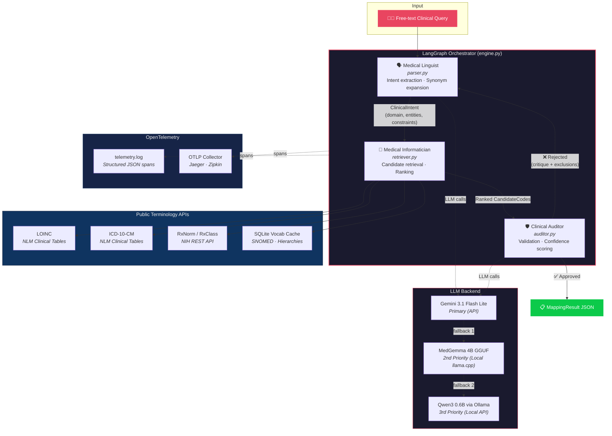
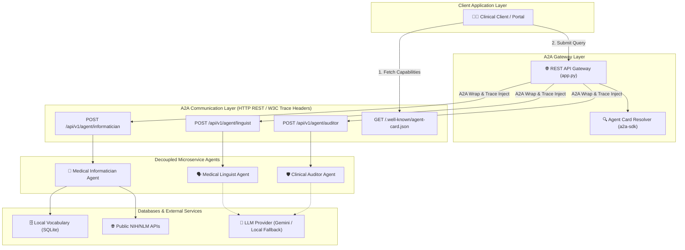
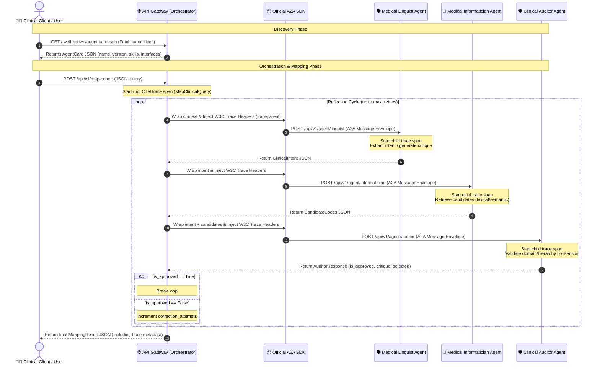

# Clinical Cohort Query Mapper (CDGR)

An **agentic AI system** that maps free-form clinical cohort queries to standardized medical terminology codes using a self-correcting **Consensus-Driven Graph Reflexion (CDGR)** pipeline.

## Overview

Given a natural language query like _"Patients with HbA1c above 7%"_, the system:

1. **Parses** the clinical intent (entity, domain, constraints, synonyms)
2. **Retrieves** candidate codes from public terminology APIs and a local vocabulary cache
3. **Ranks** candidates using a clinical relevance scoring function
4. **Audits** selections via an LLM critic — rejecting overly broad or incorrect codes
5. **Self-corrects** by looping back through parsing and retrieval if the audit fails

The output is a structured JSON mapping including interpreted meaning, candidate codes, selected codes with confidence scores, rejected candidates with reasons, and cohort logic.

## Supported Vocabularies

| Domain | Vocabulary | Source |
|---|---|---|
| Measurements / Observations | **LOINC** | NLM Clinical Table Search |
| Conditions / Diagnoses | **ICD-10-CM** | NLM Clinical Table Search |
| Drugs / Medications | **RxNorm** | NIH RxNorm REST API |
| Procedures | **SNOMED CT** | Local vocabulary cache |

All data sources are **publicly available** — no proprietary code systems are used.

## Architecture



### Reflexion Loop Detail

```mermaid
sequenceDiagram
    participant User
    participant Engine as Orchestrator
    participant Parser as Medical Linguist
    participant Retriever as Medical Informatician
    participant Auditor as Clinical Auditor
    participant API as Public APIs

    User->>Engine: "Patients with CKD stage 3"
    
    rect rgb(26, 26, 46)
    Note over Engine: Attempt 1
    Engine->>Parser: Parse query
    Parser-->>Engine: domain=condition, entity=CKD stage 3
    Engine->>Retriever: Retrieve candidates
    Retriever->>API: Query ICD-10-CM
    API-->>Retriever: N18.9 (unspecified), N18.30, N18.31, N18.32
    Retriever-->>Engine: Ranked candidates
    Engine->>Auditor: Audit candidates
    Auditor-->>Engine: ❌ REJECT N18.9 — too broad for "stage 3"
    end

    rect rgb(15, 52, 96)
    Note over Engine: Attempt 2 (Self-Correction)
    Engine->>Parser: Re-parse with critique (exclude N18.9)
    Parser-->>Engine: Refined intent + exclusion rules
    Engine->>Retriever: Retrieve with exclusions
    Retriever->>API: Query children of N18
    API-->>Retriever: N18.30, N18.31, N18.32
    Retriever-->>Engine: Filtered candidates
    Engine->>Auditor: Re-audit
    Auditor-->>Engine: ✅ APPROVED — stage-specific codes
    end

    Engine-->>User: MappingResult JSON (N18.30, N18.31, N18.32)
```



## Quick Start

### Prerequisites
- Python 3.11+
- [uv](https://docs.astral.sh/uv/) (recommended) or pip

### Installation
```bash
# Clone the repository
git clone https://github.com/mjpvl-ai/clinical-cohort-mapper.git
cd clinical-cohort-mapper

# Create virtual environment and install dependencies
uv venv && uv pip install pydantic langgraph opentelemetry-api opentelemetry-sdk fastapi uvicorn httpx a2a-sdk

# Configure your Gemini API key
echo 'GEMINI_API_KEY=your_key_here' > .env
```

### Usage

**Single query:**
```bash
python run.py --query "Patients with HbA1c above 7%"
```

**Batch mode (all 20 sample queries):**
```bash
python run.py --batch --output results.json
```

### Running Tests
```bash
.venv/bin/pytest tests/test_mapper.py
```

## Output Format

Each query produces a structured JSON result:

```json
{
  "query": "Patients with HbA1c above 7%",
  "interpreted_meaning": {
    "clinical_entities": ["Hemoglobin A1c"],
    "domain": "measurement",
    "constraint": { "operator": ">", "value": 7, "unit": "%" }
  },
  "selected_codes": [
    { "vocabulary": "LOINC", "code": "4548-4", "display": "Hemoglobin A1c/Hemoglobin.total", "confidence": 1.0 }
  ],
  "rejected_candidates": [
    { "code": "17856-6", "reason": "Less specific variant..." }
  ],
  "final_logic": { "concept": "HbA1c measurement", "condition": "value > 7%" }
}
```

## Observability & Distributed Tracing

The pipeline is instrumented with the **OpenTelemetry (OTel)** standard. Spans are also logged locally to `telemetry.log` as structured JSON lines.

You can visualize and trace the CDGR pipeline execution using either a lightweight zero-dependency tool or a full Docker-based observability stack.

---

### Option 1: Lightweight Observability with Otelite (Recommended)

[Otelite](https://github.com/planetf1/otelite) is a lightweight, zero-dependency OpenTelemetry receiver and dashboard designed for local LLM development. It starts in seconds and uses minimal system resources (<100MB RAM).

#### 1. Install Otelite
*   **Via curl installer (Linux/macOS):**
    ```bash
    curl --proto '=https' --tlsv1.2 -LsSf https://github.com/planetf1/otelite/releases/latest/download/otelite-installer.sh | sh
    ```
*   **Via Cargo (Rust):**
    ```bash
    cargo install otelite
    ```
*   **Via Homebrew (macOS):**
    ```bash
    brew install planetf1/tap/otelite
    ```

#### 2. Start the Receiver & Dashboard
```bash
otelite serve
```
This launches:
*   An OTLP HTTP receiver on `localhost:4318` (automatically probed and used by the mapper)
*   A real-time Web Dashboard at [http://localhost:3000](http://localhost:3000)
*   A Terminal UI (`otelite tui` in another shell)

#### 3. Run a Query
```bash
python run.py --query "Patients with HbA1c above 7%"
```
The clinical mapper auto-detects `otelite` listening on port `4318` and exports traces automatically.

#### 4. View Spans
Open [http://localhost:3000](http://localhost:3000) in your browser or run `otelite tui` in the terminal to inspect traces, waterfall charts, token usage metrics, latency breakdown (TTFT), and LLM cost estimation.

---

### Option 2: Full Observability Stack (Grafana + Tempo)

If you prefer a full enterprise-style stack, you can run Grafana and Tempo via Docker Compose.

#### 1. Start the Stack
```bash
docker compose up -d
```
This starts:
*   **Grafana** → [http://localhost:3000](http://localhost:3000) (no login required)
*   **Tempo** → receives OTLP traces on ports `4317` (gRPC) / `4318` (HTTP)

#### 2. Run a Query
```bash
python run.py --query "Patients with HbA1c above 7%"
```
The mapper auto-detects the Tempo OTLP receiver on port `4318` and exports traces.

#### 3. View Traces in Grafana
1. Open [http://localhost:3000/explore](http://localhost:3000/explore)
2. Select **Tempo** as the datasource.
3. Switch to **Search** query type.
4. Set Service Name = `clinical-cohort-mapper`.
5. Click **Run query** and click on a trace to see the waterfall timeline.

---

### Trace Structure & Attributes

Regardless of the visualizer, each clinical query trace details the CDGR agent reflexion loop:

```
MapClinicalQuery (clinical.query, clinical.top_code, clinical.status)
  ├── Parser.parse_query (clinical.domain, clinical.attempt)
  ├── TerminologyClient.retrieve (clinical.candidate_count)
  └── Auditor.audit (clinical.is_approved, clinical.selected_count)
```


## Production Scalability & Improvement Plan

To transition this prototype to support enterprise-scale terminology schemas (such as the full UMLS Metathesaurus or OHDSI Athena containing **3M+ concepts and relationships**), the following improvements must be implemented:

1. **Database Search Upgrades (Lexical Match)**:
   - *Current Bottleneck*: SQL queries use `LIKE '%term%'` patterns, which bypass index lookups and cause full-table scans. At 3M+ records, query latency spikes.
   - *Improvement*: Upgrade SQLite to use the **FTS5 (Full-Text Search)** extension for tokenized matching, or migrate to **Elasticsearch / OpenSearch** or **PostgreSQL** with GIN (`pg_trgm`) indexing.

2. **Ingest Vocabularies Locally (Zero Network Latency)**:
   - *Current Bottleneck*: Synchronous HTTP calls to live NIH (RxNorm) and NLM (Clinical Tables) endpoints add 3–10s latency and lead to rate limiting (HTTP 429).
   - *Improvement*: Download and ingest standard vocabulary files (from OHDSI Athena or UMLS releases) directly into a local database cluster. Eliminate all external REST API calls.

3. **Graph-Native Hierarchical Traversal**:
   - *Current Bottleneck*: Multi-level relationship navigation (parent/child/descendant trees) uses single-step sequential lookups.
   - *Improvement*: Use **recursive SQL Common Table Expressions (CTEs)** or migrate to a graph-native store like **Neo4j** for low-latency traversal of deep concept hierarchies.

4. **Semantic Caching Layer**:
   - *Current Bottleneck*: Every query executes 2–4 sequential LLM calls (Linguist, Informatician, Auditor) incurring high token costs and latency.
   - *Improvement*: Implement a **Redis Semantic Cache** (using vector embeddings) to map identical or conceptually equivalent queries (e.g., matching "taking metformin" to "on metformin") instantly (<15ms) without calling the LLM backend.

5. **Asynchronous Runtime Orchestration**:
   - *Current Bottleneck*: Node actions and network requests run synchronously, blocking thread execution.
   - *Improvement*: Refactor the database connector, API client, and LangGraph workflow using Python's `asyncio` (`async/await`) to process thousands of queries concurrently.

6. **Candidate Scoring & Ranking Optimization at Scale**:
   - *Current Bottleneck*: The `_rank_candidates` function ranks concepts in memory using a Python loop. Iterating over 3M records using Python string matching (`in`) and sorting in memory would cause severe CPU bottlenecks and consume gigabytes of RAM.
   - *Improvement*: 
     - **Push Down Scoring**: Shift lexical and prefix matches (Factors 2 and 3) directly to the database layer (e.g., Elasticsearch BM25 or PostgreSQL `ts_rank`).
     - **Pre-filtering**: Apply strict vocabulary and domain filters (Factor 1) directly in the database `WHERE` clause to prune the candidate pool from 3M to a few hundred.
     - **Top-K Retrieval**: Retrieve only the top 100–200 candidates from the database for downstream processing, rather than pulling all candidates into memory.
     - **Vector Search**: Use dense embeddings and a vector database (e.g., Milvus, pgvector) for Approximate Nearest Neighbor (ANN) search to score semantic similarity in milliseconds.

## Performance, Cost & Robustness Profile

The following section outlines the trade-offs of this prototype implementation and the target paths for enterprise production deployment.

### Latency Profile
*   **Single-Pass Mapping**: **7 – 10 seconds** (primarily due to synchronous remote REST API roundtrips and Gemini inference latency).
*   **Self-Correction Loop** (1–2 retries): **20 – 35 seconds** (accumulating multiple sequential parser, retrieval, and auditor steps).
*   *Production Target*: **<300ms** for first-pass; **<15ms** for cached queries. This is achieved by local vocabulary database indexing and semantic caching.

### Cost Profile
*   **Prototype Cost**: **~$0.001 – $0.003** per query (utilizing public APIs and Gemini 3.1 Flash-Lite).
*   **Token footprint**: Average of ~5k tokens (input + output) per run. Retries scale token volume linearly.
*   *Production Target*: **$0.00** marginal cost per query. This is achieved by hosting a specialized, fine-tuned local model (e.g., Llama-3-8B) on-premise, which also secures patient search privacy (HIPAA compliance).

### Robustness & Clinical Reliability
*   **Reflexion Loop Safeguards**: The auditor agent's self-correcting logic successfully flags and filters out clinically imprecise matches (e.g., rejecting unspecified `N18.9` for CKD Stage 3). This is significantly more precise than single-pass vector database matches.
*   **Prototype Outage Risks**: Heavy reliance on live public API endpoints (NIH RxNorm, NLM) means external downtime halts LOINC/ICD-10/RxNorm lookups. If Gemini rate-limits (HTTP 429), fallback to the local `medgemma-4b-it` GGUF or local `qwen3:0.6b` helps preserve intent parsing accuracy.
*   *Production Target*: **99.99% reliability** via a self-hosted database cluster (no internet required), high-performance local fallbacks (e.g. Llama-3-70B), and a human-in-the-loop (HITL) manual review interface for queries with confidence scores `< 0.85`.

## Extending to Proprietary Vocabularies

To support a proprietary clinical code system (containing Code IDs, Display names, Domains/Categories, Synonyms, Parent/Child relationships, and mappings to standard public vocabularies) while maintaining high recall and precision, the CDGR pipeline adapts as follows:

1. **Ingestion & Cache Layer**: The proprietary system is ingested into the local cache (`mapper/db.py`), storing display names and synonyms for rapid lexical matching (e.g. SQLite FTS5), parent/child relationships to build hierarchical lookup tables, and a cross-map table linking proprietary codes to standard terminologies (e.g., LOINC, ICD-10, RxNorm).
2. **Recall Optimization (Informatician)**: 
   - **Direct & Bridged Lookup**: The retriever matches search terms and synonyms directly against proprietary display names and synonyms. In addition, any standard public codes retrieved via NLM/RxNorm APIs are used as a "bridge" to cross-reference and pull in mapped proprietary codes.
   - **Hierarchical Expansion**: General matches automatically pull in their parent/child lineage to ensure all relevant specificity levels are included in the initial candidate pool.
3. **Precision Optimization (Auditor & Reflexion)**:
   - **Domain Filtering**: Instantly filters out candidates with mismatched domains/categories.
   - **Contextual Lineage Checks**: The LLM Auditor is fed the parent/child lineage of candidate codes to verify exact alignment with the query's clinical constraints.
   - **Reflexion Loop Routing**: If a code is rejected as too broad or narrow, the critic's feedback guides the retriever to traverse up or down the parent/child graph to fetch precise variants in the next reflexion loop.

## Exposing the Pipeline as a REST API with A2A Protocol

To serve production healthcare workflows, the CDGR mapping engine is exposed as a stateless **REST API** endpoint that accepts a raw clinical query as input and returns a structured JSON mapping:

```http
POST /api/v1/map-cohort
Content-Type: application/json

{
  "query": "Patients with HbA1c above 7%"
}
```

### Why the Agent-to-Agent (A2A) Protocol is Utilized & Its Advantages

Integrating the **A2A protocol** at the API gateway layer is essential for orchestrating distributed, secure, and observable cohort mappings in enterprise environments:

#### The Need for A2A:
1. **Network Boundary Isolation**: In clinical setups, terminology databases often reside behind private, hospital-managed firewalls. A monolithic central application cannot directly query them. Wrapping local databases as A2A-compliant agents allows them to receive incoming queries securely without exposing raw databases to the external internet.
2. **Heterogeneous Runtime Scaling**: The *Linguist* and *Auditor* are LLM-driven agents requiring GPU-enabled environments. The *Informatician* is CPU/RAM intensive. Decoupling them using A2A prevents resource contention and optimizes infrastructure costs.
3. **Open Interoperability**: Healthcare architectures combine microservices built on different stacks (Python, Go, Node.js). A2A provides a language-agnostic interface with standard message wrappers.

#### Core Advantages:
*   **Federated Discovery (Agent Cards)**: The server publishes its details, version, and schemas via the `GET /.well-known/agent-card.json` endpoint using the official Python `a2a-sdk`. Peer agents and gateways query this dynamically to discover skills.
*   **Standardized Task Lifecycles**: Supports standard task creation and cancellation states, allowing long-running cohort mappings to execute asynchronously.

#### A2A Architecture & Communication Diagrams

##### 1. Network Component Topology
The topology diagram below outlines the separation of concerns, the API endpoints exposed, and where the A2A layer intersects:



##### 2. Agent-to-Agent Communication Sequence Flow
The sequence diagram details the consensus-driven loop and trace header injection across microservice requests:



### Starting and Querying the A2A Server

#### 1. Start the Server
Start the FastAPI server on port `8000`:
```bash
python app.py
```

#### 2. Query the Gateway
You can trigger the CDGR orchestrator using a standard `curl` request:
```bash
curl -X POST http://127.0.0.1:8000/api/v1/map-cohort \
     -H "Content-Type: application/json" \
     -d '{"query": "Patients currently taking metformin", "max_retries": 3}'
```

#### 3. Query Individual Agents Directly (A2A Style)
Because the agents are decoupled, you can also interact with them directly:
*   **Medical Linguist**:
    ```bash
    curl -X POST http://127.0.0.1:8000/api/v1/agent/linguist \
         -H "Content-Type: application/json" \
         -d '{"query": "Patients with HbA1c above 7%"}'
    ```
*   **Medical Informatician**:
    ```bash
    curl -X POST http://127.0.0.1:8000/api/v1/agent/informatician \
         -H "Content-Type: application/json" \
         -d '{"intent": {"original_query": "Patients with HbA1c above 7%", "clinical_entities": ["HbA1c"], "synonyms": ["glycated hemoglobin"], "domain": "measurement", "status": "any", "constraint": {"operator": ">", "value": 7.0, "unit": "%"}}}'
    ```
*   **Clinical Auditor**:
    ```bash
    curl -X POST http://127.0.0.1:8000/api/v1/agent/auditor \
         -H "Content-Type: application/json" \
         -d '{"intent": {"original_query": "Patients with HbA1c above 7%", "clinical_entities": ["HbA1c"], "synonyms": ["glycated hemoglobin"], "domain": "measurement", "status": "any", "constraint": {"operator": ">", "value": 7.0, "unit": "%"}}, "candidates": [{"vocabulary": "LOINC", "code": "4548-4", "display": "Hemoglobin A1c/Hemoglobin.total in Blood", "rank": 1}]}'
    ```

When querying the gateway `/api/v1/map-cohort`, the system will generate a parent trace context and automatically propagate it to each of these sub-agent HTTP requests, creating a beautiful nested span waterfall in your telemetry dashboard.

## Key Design Decisions

- **No proprietary APIs** — all terminology lookups use free, public NIH/NLM endpoints
- **Self-correction over single-pass** — the reflexion loop prevents clinically incorrect mappings (e.g. rejecting `N18.9` "CKD unspecified" when the query asks for "CKD stage 3")
- **Deterministic ranking** — explicit scoring function (not purely LLM-based) for reproducibility
- **Gemini API with local fallback** — uses `gemini-3.1-flash-lite` with cascading fallbacks to local `medgemma-4b-it` GGUF (via `llama-cpp-python`) as second priority and `qwen3:0.6b` (via Ollama) as third priority

## License

This project was built as a take-home assessment prototype.
