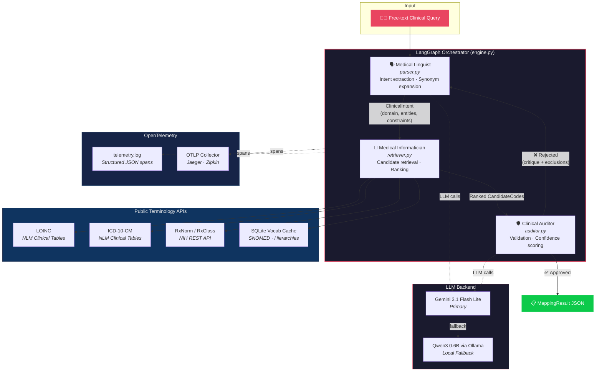

# Clinical Cohort Query Mapper (CDGR)

An **agentic AI system** that maps free-form clinical cohort queries to standardized medical terminology codes using a self-correcting **Consensus-Driven Graph Reflexion (CDGR)** pipeline.

## Overview

Given a natural language query like _"Patients with HbA1c above 7%"_, the system:

1. **Parses** the clinical intent (entity, domain, constraints, synonyms)
2. **Retrieves** candidate codes from public terminology APIs and a local vocabulary cache
3. **Ranks** candidates using a clinical relevance scoring function
4. **Audits** selections via an LLM critic — rejecting overly broad or incorrect codes
5. **Self-corrects** by looping back through parsing and retrieval if the audit fails

The output is a structured JSON mapping including interpreted meaning, candidate codes, selected codes with confidence scores, rejected candidates with reasons, and cohort logic.

## Supported Vocabularies

| Domain | Vocabulary | Source |
|---|---|---|
| Measurements / Observations | **LOINC** | NLM Clinical Table Search |
| Conditions / Diagnoses | **ICD-10-CM** | NLM Clinical Table Search |
| Drugs / Medications | **RxNorm** | NIH RxNorm REST API |
| Procedures | **SNOMED CT** | Local vocabulary cache |

All data sources are **publicly available** — no proprietary code systems are used.

## Architecture



### Reflexion Loop Detail

```mermaid
sequenceDiagram
    participant User
    participant Engine as Orchestrator
    participant Parser as Medical Linguist
    participant Retriever as Medical Informatician
    participant Auditor as Clinical Auditor
    participant API as Public APIs

    User->>Engine: "Patients with CKD stage 3"
    
    rect rgb(26, 26, 46)
    Note over Engine: Attempt 1
    Engine->>Parser: Parse query
    Parser-->>Engine: domain=condition, entity=CKD stage 3
    Engine->>Retriever: Retrieve candidates
    Retriever->>API: Query ICD-10-CM
    API-->>Retriever: N18.9 (unspecified), N18.30, N18.31, N18.32
    Retriever-->>Engine: Ranked candidates
    Engine->>Auditor: Audit candidates
    Auditor-->>Engine: ❌ REJECT N18.9 — too broad for "stage 3"
    end

    rect rgb(15, 52, 96)
    Note over Engine: Attempt 2 (Self-Correction)
    Engine->>Parser: Re-parse with critique (exclude N18.9)
    Parser-->>Engine: Refined intent + exclusion rules
    Engine->>Retriever: Retrieve with exclusions
    Retriever->>API: Query children of N18
    API-->>Retriever: N18.30, N18.31, N18.32
    Retriever-->>Engine: Filtered candidates
    Engine->>Auditor: Re-audit
    Auditor-->>Engine: ✅ APPROVED — stage-specific codes
    end

    Engine-->>User: MappingResult JSON (N18.30, N18.31, N18.32)
```



## Quick Start

### Prerequisites
- Python 3.11+
- [uv](https://docs.astral.sh/uv/) (recommended) or pip

### Installation
```bash
# Clone the repository
git clone https://github.com/mjpvl-ai/clinical-cohort-mapper.git
cd clinical-cohort-mapper

# Create virtual environment and install dependencies
uv venv && uv pip install pydantic langgraph opentelemetry-api opentelemetry-sdk

# Configure your Gemini API key
echo 'GEMINI_API_KEY=your_key_here' > .env
```

### Usage

**Single query:**
```bash
python run.py --query "Patients with HbA1c above 7%"
```

**Batch mode (all 20 sample queries):**
```bash
python run.py --batch --output results.json
```

### Running Tests
```bash
.venv/bin/pytest tests/test_mapper.py
```

## Output Format

Each query produces a structured JSON result:

```json
{
  "query": "Patients with HbA1c above 7%",
  "interpreted_meaning": {
    "clinical_entities": ["Hemoglobin A1c"],
    "domain": "measurement",
    "constraint": { "operator": ">", "value": 7, "unit": "%" }
  },
  "selected_codes": [
    { "vocabulary": "LOINC", "code": "4548-4", "display": "Hemoglobin A1c/Hemoglobin.total", "confidence": 1.0 }
  ],
  "rejected_candidates": [
    { "code": "17856-6", "reason": "Less specific variant..." }
  ],
  "final_logic": { "concept": "HbA1c measurement", "condition": "value > 7%" }
}
```

## Observability (OpenTelemetry)

The pipeline is instrumented with the **OpenTelemetry** standard. Each query execution produces nested spans:

```
MapClinicalQuery
  ├── Parser.parse_query
  ├── TerminologyClient.retrieve
  └── Auditor.audit
```

Spans are exported to `telemetry.log` as structured JSON lines. Set `OTEL_EXPORTER_OTLP_ENDPOINT` to export to a collector (Jaeger, Zipkin, etc.).

## Key Design Decisions

- **No proprietary APIs** — all terminology lookups use free, public NIH/NLM endpoints
- **Self-correction over single-pass** — the reflexion loop prevents clinically incorrect mappings (e.g. rejecting `N18.9` "CKD unspecified" when the query asks for "CKD stage 3")
- **Deterministic ranking** — explicit scoring function (not purely LLM-based) for reproducibility
- **Gemini API with local fallback** — uses `gemini-3.1-flash-lite` with fallback to local `qwen3:0.6b` via Ollama

## License

This project was built as a take-home assessment prototype.
