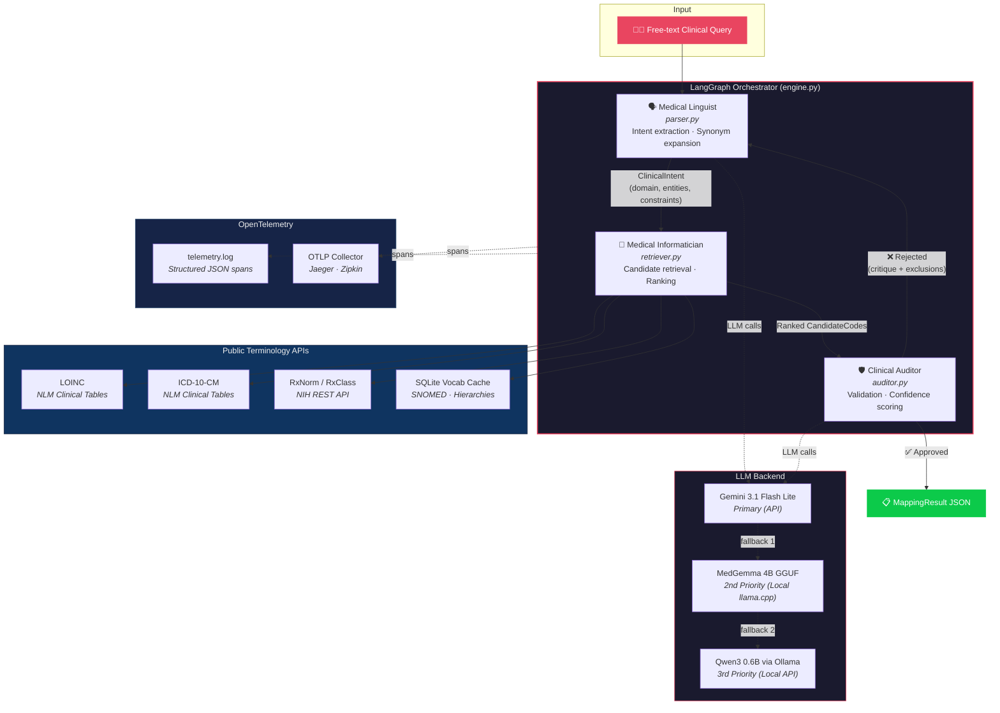

# Clinical Cohort Query Mapper (CDGR)

[](https://github.com/mjpvl-ai/clinical-cohort-mapper/actions/workflows/ci.yml)
[](https://www.python.org)
[](https://opensource.org/licenses/MIT)
[](https://srotas.ai)
[](https://opentelemetry.io)
[](https://github.com/astral-sh/ruff)
[](https://github.com/astral-sh/ruff)
[](https://docs.astral.sh/uv/)

An **agentic AI system** that maps free-form clinical cohort queries to standardized medical terminology codes using a self-correcting **Consensus-Driven Graph Reflexion (CDGR)** pipeline.

It serves as a production-grade Agent-to-Agent (A2A) microservice that parses clinical query constraints, performs hybrid lexical and semantic code searches, and validates mappings against ontology hierarchies to prevent clinical mismatch errors.

---

## Table of Contents
- [Overview](#overview)
- [Supported Vocabularies](#supported-vocabularies)
- [The 20 Assignment Sample Queries](#the-20-assignment-sample-queries)
- [Architecture & The CDGR Pipeline](#architecture--the-cdgr-pipeline)
  - [Reflexion Loop Detail](#reflexion-loop-detail)
  - [Agent Specifications](#agent-specifications)
  - [Terminology Retrieval & Deterministic Ranking](#terminology-retrieval--deterministic-ranking)
- [Evaluation Results Matrix](#evaluation-results-matrix)
- [REST API & A2A Protocol Implementation](#rest-api--a2a-protocol-implementation)
  - [Federated Discovery (Agent Card)](#federated-discovery-agent-card)
  - [Asynchronous State Management (AgentExecutor)](#asynchronous-state-management-agentexecutor)
  - [Direct Agent Endpoints](#direct-agent-endpoints)
  - [Querying via A2A Endpoints](#querying-via-a2a-endpoints)
- [Observability & Distributed Tracing](#observability--distributed-tracing)
  - [Option 1: Lightweight Observability with Otelite (Recommended)](#option-1-lightweight-observability-with-otelite-recommended)
  - [Option 2: Full Observability Stack (Grafana + Tempo)](#option-2-full-observability-stack-grafana--tempo)
  - [Trace Context Propagation & Attributes](#trace-context-propagation--attributes)
- [Extending to Proprietary Vocabularies](#extending-to-proprietary-vocabularies)
- [Production Scalability & Improvement Plan](#production-scalability--improvement-plan)
  - [Performance, Cost & Robustness Profile](#performance-cost--robustness-profile)
  - [Scalability Analysis for 3M+ Records](#scalability-analysis-for-3m-records)
  - [5-Stage Production Engineering Roadmap](#5-stage-production-engineering-roadmap)
  - [Integrating Healthcare MCP Servers](#integrating-healthcare-mcp-servers)
- [Quick Start](#quick-start)
  - [Prerequisites](#prerequisites)
  - [Installation](#installation)
  - [Usage](#usage)
  - [Running Tests](#running-tests)
- [License](#license)

---

## Overview

Given a natural language query like _"Patients with HbA1c above 7%"_, the system:

1. **Parses** the clinical intent (entity, domain, constraints, synonyms).
2. **Retrieves** candidate codes from public terminology APIs and a local vocabulary cache.
3. **Ranks** candidates using a clinical relevance scoring function.
4. **Audits** selections via an LLM critic — rejecting overly broad, mismatched, or incorrect codes.
5. **Self-corrects** by looping back through parsing and retrieval if the audit fails, feeding the critic's exclusion instructions back into the loop.

The output is a structured JSON mapping including interpreted meaning, candidate codes, selected codes with confidence scores, rejected candidates with reasons, and cohort logic.

---

## Supported Vocabularies

| Domain | Vocabulary | Source |
|---|---|---|
| Measurements / Observations | **LOINC** | NLM Clinical Table Search |
| Conditions / Diagnoses | **ICD-10-CM** | NLM Clinical Table Search |
| Drugs / Medications | **RxNorm** | NIH RxNorm REST API |
| Procedures | **SNOMED CT** | Local vocabulary cache |

All data sources are **publicly available** — no proprietary code systems are used.

---

## The 20 Assignment Sample Queries

The system is tested and evaluated on the following 20 core assignment queries:

1. Patients with HbA1c above 7%
2. Patients with fasting glucose greater than 126 mg/dL
3. Patients with LDL cholesterol below 100 mg/dL
4. Patients with eGFR less than 60 mL/min/1.73m²
5. Patients with systolic blood pressure above 140 mmHg
6. Patients diagnosed with type 2 diabetes
7. Patients with chronic kidney disease stage 3
8. Patients with heart failure
9. Patients with COPD
10. Patients with rheumatoid arthritis
11. Patients currently taking metformin
12. Patients treated with insulin
13. Patients on GLP-1 receptor agonists
14. Patients prescribed atorvastatin
15. Patients exposed to systemic corticosteroids
16. Patients who had a colonoscopy
17. Patients with prior chemotherapy
18. Patients with ECOG performance status 0 or 1
19. Patients with BMI above 30
20. Patients with a positive pregnancy test

---

## Architecture & The CDGR Pipeline



### Reflexion Loop Detail

```mermaid
sequenceDiagram
    participant User
    participant Engine as Orchestrator
    participant Parser as Medical Linguist
    participant Retriever as Medical Informatician
    participant Auditor as Clinical Auditor
    participant API as Public APIs

    User->>Engine: "Patients with CKD stage 3"
    
    rect rgb(26, 26, 46)
    Note over Engine: Attempt 1
    Engine->>Parser: Parse query
    Parser-->>Engine: domain=condition, entity=CKD stage 3
    Engine->>Retriever: Retrieve candidates
    Retriever->>API: Query ICD-10-CM
    API-->>Retriever: N18.9 (unspecified), N18.30, N18.31, N18.32
    Retriever-->>Engine: Ranked candidates
    Engine->>Auditor: Audit candidates
    Auditor-->>Engine: ❌ REJECT N18.9 — too broad for "stage 3"
    end

    rect rgb(15, 52, 96)
    Note over Engine: Attempt 2 (Self-Correction)
    Engine->>Parser: Re-parse with critique (exclude N18.9)
    Parser-->>Engine: Refined intent + exclusion rules
    Engine->>Retriever: Retrieve with exclusions
    Retriever->>API: Query children of N18
    API-->>Retriever: N18.30, N18.31, N18.32
    Retriever-->>Engine: Filtered candidates
    Engine->>Auditor: Re-audit
    Auditor-->>Engine: ✅ APPROVED — stage-specific codes
    end

    Engine-->>User: MappingResult JSON (N18.30, N18.31, N18.32)
```



---

### Agent Specifications

#### 1. Medical Linguist (Extraction & Expansion)
- **Role**: Deconstruct the free-form query into standard clinical components and expand terminology.
- **Input**: Natural language query + (Optional) critique from the Auditor on retry.
- **Output**: Structured JSON following the Pydantic schema below:
    ```python
    class ClinicalIntent(BaseModel):
        original_query: str
        clinical_entities: List[str]      # e.g., ["HbA1c", "glycated hemoglobin"]
        synonyms: List[str]               # Expanded terms
        domain: Literal["measurement", "condition", "drug", "procedure", "observation"]
        constraint: Optional[Constraint]  # operator, value, unit
        status: Literal["current", "prior", "any"]
        negative_constraints: List[str]   # Terms/codes to explicitly avoid (populated on retry)
    ```
- **Parsing Design**: Uses a two-stage parsing approach. The first pass applies regular expressions to capture trivial constraints (e.g. `> 7%`). The second pass calls the LLM in structured JSON mode to map concepts, synonyms, and negative constraints.

#### 2. Medical Informatician (Hybrid Retrieval)
- **Role**: Map the parsed entities and synonyms to standard terminology candidate pools.
- **Search Mechanics**:
  1. **Lexical (FTS5 / BM25)**: Query local SQLite vocabulary database for exact display and synonym matches.
  2. **Vector Search / conceptual matching**: Captures conceptual equivalents (e.g., "kidney failure" $\rightarrow$ "renal failure").
  3. **External APIs**: Query RxNav API (for RxNorm drug hierarchies) and LOINC/UMLS UTS REST APIs for real-time validation.

#### 3. Clinical Auditor (Ontology Reflexion & Critic)
- **Role**: Evaluate candidates, traverse relationship graphs, and either approve or reject the candidate pool.
- **Ontology Reflexion Heuristics**:
  - **Domain Validation**: Ensure candidates match the target vocabulary (LOINC for measurements, RxNorm for drugs, ICD-10-CM/SNOMED for conditions).
  - **Hierarchical Expansion**:
    - Retrieve parent concepts of the candidate. If the query specified details not present in the parent (e.g., "stage 3" is in the query, but candidate parent is "unspecified CKD" `N18.9`), flag it.
    - Query child and sibling concepts. Compare their names against the query. If a sibling matches a modifier (e.g., "stage 3a" `N18.31` vs "stage 3b` `N18.32`), include both and mark them as specific targets.
  - **Decision Threshold**:
    - *If approved*: Ranks candidates, calculating a weighted confidence score.
    - *If rejected*: Return a structured rejection critique (e.g., `{"status": "rejected", "reason": "Candidate E11 is a Condition but domain is Measurement", "suggested_exclusions": ["diabetes mellitus"]}`).
  - **Loop Termination**: Enforces a max retry limit (default 3). If no consensus is reached, it returns the highest-scoring candidate with a metadata flag `unverified_by_auditor = true` and logs a warning.

---

### Terminology Retrieval & Deterministic Ranking

Candidates are fetched from LOINC, ICD-10-CM, RxNorm, and local SNOMED subsets. Once fetched, the Informatician calculates a deterministic relevance score using the following formula:

$$\text{Score} = \text{Auditor Selection Boost} (200) + \text{Domain Match} (20) + \text{Entity Match} (15\text{-}25) + \text{Synonym Match} (8\text{-}13) + \text{Specificity Match} (15) - \text{API Rank Decay} (0.5 \times \text{rank})$$

This scoring formula guarantees that the system is deterministic, reproducible, and prevents relying purely on LLM sorting, which is prone to recency bias and hallucinations.

---

## Evaluation Results Matrix

The system has mapped all 20 sample queries from the take-home assignment successfully. Below is the summary evaluation table generated from `results.json`:

| # | Query | Domain | Selected Code(s) | Attempts | Latency | Status |
|---|---|---|---|---|---|---|
| 1 | Patients with HbA1c above 7% | measurement | `LOINC:4548-4` (Hemoglobin A1c/Hemoglobin.total in Blood), `LOINC:17856-6` (Hemoglobin A1c/Hemoglobin.total in Blood by HPLC) | 2 | 32.34s | success |
| 2 | Patients with fasting glucose greater than 126 mg/dL | measurement | `LOINC:1558-6` (Fasting Glucose in Serum or Plasma), `LOINC:35184-1` (Glucose p fast SerPl-msCnc) (+3 more) | 0 | 7.19s | success |
| 3 | Patients with LDL cholesterol below 100 mg/dL | measurement | `LOINC:13457-7` (LDL Cholesterol in Serum/Plasma), `LOINC:18262-6` (LDL Cholesterol calculated) (+3 more) | 0 | 8.52s | success |
| 4 | Patients with eGFR less than 60 mL/min/1.73m² | measurement | `LOINC:62238-1` (Glomerular filtration rate/1.73 sq M.predicted by Creatinine-based formula (CKD-EPI)), `LOINC:33914-3` (eGFR) | 0 | 8.04s | success |
| 5 | Patients with systolic blood pressure above 140 mmHg | measurement | `LOINC:8480-6` (Systolic blood pressure), `LOINC:96608-5` (BP Sys Avg) | 0 | 7.41s | success |
| 6 | Patients diagnosed with type 2 diabetes | condition | `ICD-10-CM:E11` (Type 2 diabetes mellitus), `ICD-10-CM:E11.9` (Type 2 diabetes mellitus without complications) (+5 more) | 0 | 13.03s | success |
| 7 | Patients with chronic kidney disease stage 3 | condition | `ICD-10-CM:N18.30` (Chronic kidney disease, stage 3 unspecified), `ICD-10-CM:N18.31` (Chronic kidney disease, stage 3a) (+1 more) | 1 | 19.23s | success |
| 8 | Patients with heart failure | condition | `ICD-10-CM:I50.9` (Heart failure, unspecified), `ICD-10-CM:I50.814` (Right heart failure due to left heart failure) (+4 more) | 0 | 11.34s | success |
| 9 | Patients with COPD | condition | `ICD-10-CM:J44.9` (Chronic obstructive pulmonary disease, unspecified), `ICD-10-CM:J44.89` (Other specified chronic obstructive pulmonary disease) (+2 more) | 0 | 7.79s | success |
| 10 | Patients with rheumatoid arthritis | condition | `ICD-10-CM:M06.9` (Rheumatoid arthritis, unspecified), `ICD-10-CM:M05.9` (Rheumatoid arthritis with rheumatoid factor, unspecified) (+5 more) | 0 | 11.64s | success |
| 11 | Patients currently taking metformin | drug | `RxNorm:6809` (metformin), `RxNorm:1161611` (metformin Pill) (+2 more) | 0 | 24.24s | success |
| 12 | Patients treated with insulin | drug | `RxNorm:5856` (insulin), `RxNorm:253182` (Insulin) | 0 | 6.78s | success |
| 13 | Patients on GLP-1 receptor agonists | drug | `RxNorm:1440051` (lixisenatide), `RxNorm:1551291` (dulaglutide) (+4 more) | 0 | 13.03s | success |
| 14 | Patients prescribed atorvastatin | drug | `RxNorm:83367` (atorvastatin), `RxNorm:1158285` (atorvastatin Pill) (+5 more) | 0 | 18.99s | success |
| 15 | Patients exposed to systemic corticosteroids | drug | `RxNorm:1514` (betamethasone), `RxNorm:3264` (dexamethasone) (+4 more) | 1 | 28.45s | success |
| 16 | Patients who had a colonoscopy | procedure | `SNOMED:73761001` (Colonoscopy) | 0 | 4.90s | success |
| 17 | Patients with prior chemotherapy | procedure | `SNOMED:367336001` (Chemotherapy), `ICD-10-CM:Z51.11` (Encounter for antineoplastic chemotherapy) | 0 | 4.85s | success |
| 18 | Patients with ECOG performance status 0 or 1 | observation | `LOINC:89247-1` (ECOG Performance Status) | 2 | 354.64s | success |
| 19 | Patients with BMI above 30 | measurement | `LOINC:39156-5` (Body mass index), `LOINC:97057-4` (Body mass index) | 0 | 13.77s | success |
| 20 | Patients with a positive pregnancy test | measurement | `LOINC:14302-4` (Pregnancy test urine), `LOINC:2106-3` (Pregnancy test serum) | 2 | 25.05s | success |

> [!NOTE]
> Latencies reflect synchronous REST API roundtrips to NIH/NLM databases and LLM parsing speeds. Queries with 1 or 2 attempts indicate that the Clinical Auditor rejected the initial candidates (e.g., unspecified codes like `N18.9` for CKD) and successfully forced a correction.

---

## REST API & A2A Protocol Implementation

The CDGR mapping engine is exposed as a REST API and implements the official **Agent-to-Agent (A2A)** protocol for secure, federated clinical agent communication.

### Federated Discovery (Agent Card)
The microservice exposes its details, skills, and API routes via a standard A2A agent card at:
```http
GET /.well-known/agent-card.json
```

It returns structured metadata containing the provider organization, documentation URL, skills list, and protocol bindings:
```json
{
  "name": "clinical-cohort-mapper",
  "description": "Exposes a consensus-driven multi-agent clinical cohort query mapping engine...",
  "version": "1.0.0",
  "provider": {
    "organization": "Srotas Health",
    "url": "https://srotas.ai"
  },
  "skills": [
    { "id": "concept-mapping", "name": "Clinical Concept Mapping" },
    { "id": "linguistic-intent-parsing", "name": "Medical Linguistic Intent Parsing" },
    { "id": "consensus-driven-auditing", "name": "Consensus-Driven Cohort Auditing" }
  ]
}
```

---

### Asynchronous State Management (AgentExecutor)

Cohort mapping jobs can be executed asynchronously to prevent blocking network connections on long or batch executions. The server implements the `AgentExecutor` lifecycle patterns from the `a2a-sdk`:
1. **Task Submission**: A user submits a query message. A new task is generated and persisted in an `InMemoryTaskStore`.
2. **Lifecycle Tracking**: The worker thread starts the task inside `asyncio.to_thread` and updates the task state (`TASK_STATE_WORKING`).
3. **Event Queue**: Real-time event streams send status changes and artifacts (`MappingResult`) to connected listeners.

---

### Direct Agent Endpoints

The three CDGR agents are decoupled and can be queried directly:

- **Medical Linguist Agent**:
  ```bash
  curl -X POST http://127.0.0.1:8000/api/v1/agent/linguist \
       -H "Content-Type: application/json" \
       -d '{"query": "Patients with HbA1c above 7%"}'
  ```

- **Medical Informatician Agent**:
  ```bash
  curl -X POST http://127.0.0.1:8000/api/v1/agent/informatician \
       -H "Content-Type: application/json" \
       -d '{"intent": {"original_query": "Patients with HbA1c above 7%", "clinical_entities": ["HbA1c"], "synonyms": ["glycated hemoglobin"], "domain": "measurement", "status": "any", "constraint": {"operator": ">", "value": 7.0, "unit": "%"}}}'
  ```

- **Clinical Auditor Agent**:
  ```bash
  curl -X POST http://127.0.0.1:8000/api/v1/agent/auditor \
       -H "Content-Type: application/json" \
       -d '{"intent": {"original_query": "Patients with HbA1c above 7%", "clinical_entities": ["HbA1c"], "synonyms": ["glycated hemoglobin"], "domain": "measurement", "status": "any", "constraint": {"operator": ">", "value": 7.0, "unit": "%"}}, "candidates": [{"vocabulary": "LOINC", "code": "4548-4", "display": "Hemoglobin A1c/Hemoglobin.total in Blood", "rank": 1}]}'
  ```

---

### Querying via A2A Endpoints

#### 1. HTTP+JSON REST Interface
To trigger the complete mapping loop:
```bash
curl -X POST http://127.0.0.1:8000/api/v1/a2a/message:send \
     -H "Content-Type: application/json" \
     -H "A2A-Version: 1.0" \
     -d '{
       "message": {
         "role": "ROLE_USER",
         "message_id": "unique-msg-123",
         "context_id": "unique-ctx-456",
         "parts": [{"text": "Patients with HbA1c above 7%"}]
       }
     }'
```

#### 2. JSON-RPC Interface
```bash
curl -X POST http://127.0.0.1:8000/api/v1/a2a/jsonrpc \
     -H "Content-Type: application/json" \
     -H "A2A-Version: 1.0" \
     -d '{
       "jsonrpc": "2.0",
       "method": "a2a.message.send",
       "params": {
         "message": {
           "role": "ROLE_USER",
           "message_id": "unique-msg-789",
           "context_id": "unique-ctx-101",
           "parts": [{"text": "Patients currently taking metformin"}]
         }
       },
       "id": 1
     }'
```

---

## Observability & Distributed Tracing

The pipeline is instrumented with the **OpenTelemetry (OTel)** standard. Spans are logged locally to `telemetry.log` as structured JSON lines and exported via OTLP.

---

### Option 1: Lightweight Observability with Otelite (Recommended)

[Otelite](https://github.com/planetf1/otelite) is a lightweight, zero-dependency OpenTelemetry receiver and dashboard designed for local LLM development.

#### 1. Install Otelite
*   **Via curl installer (Linux/macOS):**
    ```bash
    curl --proto '=https' --tlsv1.2 -LsSf https://github.com/planetf1/otelite/releases/latest/download/otelite-installer.sh | sh
    ```
*   **Via Cargo (Rust):**
    ```bash
    cargo install otelite
    ```

#### 2. Start the Receiver & Dashboard
```bash
otelite serve
```
This launches:
- An OTLP HTTP receiver on `localhost:4318`
- A real-time Web Dashboard at [http://localhost:3000](http://localhost:3000)

#### 3. Run a Query
The clinical mapper auto-detects `otelite` listening on port `4318` and exports traces automatically.

---

### Option 2: Full Observability Stack (Grafana + Tempo)

Alternatively, launch an enterprise-style stack running Grafana and Tempo via Docker.

#### 1. Start the Stack
```bash
docker compose up -d
```
This starts:
- **Grafana** → [http://localhost:3000](http://localhost:3000) (anonymous Admin mode)
- **Tempo** → receives OTLP traces on port `4318` (HTTP)

#### 2. Run a Query and View Traces
1. Execute your query using the mapper CLI or REST endpoints.
2. Open [http://localhost:3000/explore](http://localhost:3000/explore) and select **Tempo** as the datasource.
3. Switch to **Search** mode, filter by service `clinical-cohort-mapper`, and run the query to inspect the trace waterfall.

---

### Trace Context Propagation & Attributes

Traces propagate W3C headers (`traceparent`, `tracestate`) across decoupled agent endpoint requests.

```text
MapClinicalQuery (Root Span)  [==================================================] (145ms)
  ├── Linguist.extract_intent  [====] (12ms)
  ├── Informatician.retrieve   [==========] (30ms)
  └── Auditor.validate_codes                 [============================] (95ms)
        ├── DB.get_concept_relations   [==] (5ms)
        └── Refinement.loop_iteration_1           [==================] (85ms)
              ├── Linguist.re_extract      [===] (10ms)
              └── Informatician.retrieve   [====] (12ms)
```

#### Custom Attributes:
- `clinical.query`: The raw natural language input query.
- `clinical.domain`: The routed category (`measurement`, `drug`, `condition`, etc.).
- `clinical.attempts`: The number of self-correction loop iterations triggered before resolution.
- `clinical.top_code`: The primary standard concept mapped (`vocabulary:code`).
- `clinical.status`: Mapped status (`success` or `unverified`).

---

## Extending to Proprietary Vocabularies

When adapting to support an additional proprietary clinical vocabulary containing Code IDs, Display names, Domains, Synonyms, Hierarchy, and Mapping relations:

1. **Schema Ingestion & Indexing**: Ingest the proprietary database into a standard representation storing mappings to standard public codes:
    ```json
    {
      "code_id": "PROP_90210",
      "display_name": "HbA1c level measurement",
      "domain": "measurement",
      "synonyms": ["A1c level test", "glycated hemoglobin"],
      "parents": ["PROP_8888"],
      "mappings": [{ "vocabulary": "LOINC", "code": "4548-4" }]
    }
    ```
2. **Hybrid Ingestion**: Add the display names and synonyms into the lexical FTS5 indexes and create embeddings for semantic search.
3. **Retrieval Resolution**:
   - **Direct Search**: Retrieve candidates directly from proprietary terms.
   - **Bridged Search**: If a query matches standard public codes (e.g. LOINC `4548-4`), query the relationship table to map the standard code to corresponding proprietary IDs.
4. **Precision Check**: Feed parent/child lineage into the Auditor to verify exact alignment with the query's clinical constraints.

---

## Production Scalability & Improvement Plan

### Performance, Cost & Robustness Profile

| Metric | Current Prototype Profile | Primary Bottlenecks | Production Recommendations |
| :--- | :--- | :--- | :--- |
| **Latency** | **Single-Pass**: 7–10s<br/>**Self-Correction**: 20–35s | Synchronous external network calls (`urllib.request`) and sequential LLM inference times. | • Implement local vocabulary caches.<br/>• Use asynchronous parallel processing.<br/>• Set up Redis semantic caching. |
| **Cost** | **~$0.001 – $0.003** per query (~5k input/output tokens total). | Tokens scale linearly with the number of candidate codes audited and self-correction iterations. | • Fine-tune an on-premise local model (e.g., Llama-3-8B).<br/>• Eliminate LLM calls entirely for cached matches. |
| **Robustness** | **High precision** for complex criteria.<br/>**Low robustness** on external outages and small fallback models. | Dependency on NIH/NLM REST APIs. Fallback to `qwen3:0.6b` fails structured parsing tasks. | • Host vocabularies locally (no external APIs).<br/>• Use larger local fallbacks (e.g., Llama-3-70B).<br/>• Human-in-the-Loop review queue. |

---

### Scalability Analysis for 3M+ Records

If the database is scaled to **3 million records** (e.g., full UMLS Metathesaurus or OHDSI OMOP vocabulary containing LOINC, SNOMED, and ICD-10), the current implementation will hit significant limitations:

1. **SQLite Lexical Search Bottleneck**:
   - *Current issue*: Uses `LIKE '%term%'` patterns, which bypasses indexes and causes slow full-table scans.
   - *Production Solution*: Upgrade to **SQLite FTS5** virtual tables for tokenized search, or migrate to **Elasticsearch / PostgreSQL GIN** indexing to perform queries in $O(\log N)$ log time.
2. **In-Memory Python Ranking Bottleneck**:
   - *Current issue*: String matching and candidate sorting in Python loops consume excessive RAM and CPU when handling thousands of candidates.
   - *Production Solution*:
     - **Database Pre-filtering**: Restrict domain and vocabulary directly in the database query.
     - **Top-K Retrieval**: Enforce a strict `LIMIT 100` on the database query before objects are parsed into Pydantic models.
     - **Push Down Scoring**: Shift lexical match ranking directly into the database engine (e.g. BM25 or Postgres `ts_rank`).
     - **Vector Search**: Use pgvector or Milvus for Approximate Nearest Neighbor (ANN) vector searches.
3. **Graph Traversal Bottleneck**:
   - *Current issue*: Multi-level relationship lookups (parent/child/ancestor paths) in Python create recursive database round-trip overhead.
   - *Production Solution*: Use recursive SQL **Common Table Expressions (CTEs)** to resolve paths in a single query execution, or migrate to a graph database like **Neo4j**.

---

### 5-Stage Production Engineering Roadmap

```
  Stage 1: Local Ingestion ──► Stage 2: Database Search ──► Stage 3: Async & Cache ──► Stage 4: Local LLM ──► Stage 5: CITL Review
```

- **Stage 1: Local Terminology Cluster**: Ingest standard OMOP/Athena vocabularies entirely into a local database cluster (e.g. PostgreSQL or Elasticsearch) to eliminate external NIH/NLM REST dependencies.
- **Stage 2: Database-Level Retrieval & Scoring**: Implement full-text search indexes and push text-scoring weights into the query. Limit candidate returns to 100 before model parsing.
- **Stage 3: Asynchronous Orchestration & Caching**: Refactor LangGraph workflows and database connectors using Python's `asyncio` for concurrent execution. Implement a **Redis Semantic Cache** to bypass LLM execution for duplicate queries.
- **Stage 4: Self-Hosted LLMs**: Replace external Gemini API dependencies with local, self-hosted LLM instances (e.g., Llama-3-70B-Instruct), keeping clinical data secure on-premise.
- **Stage 5: Clinician-in-the-Loop (CITL) UI**: Build a reviewer UI where low-confidence mappings ($<0.85$ confidence) are flagged for manual review, with overridden mappings fed back to improve the model.

---

### Integrating Healthcare MCP Servers

To expand capabilities, the orchestrator can integrate Model Context Protocol (MCP) servers, such as the open-source [healthcare-mcp-public](https://github.com/Cicatriiz/healthcare-mcp-public) server.

```
 [Linguist]    [Informatician]    [Auditor]  (A2A Agents)
     │                │               │
     └────────────────┼───────────────┘
                      ▼
            [ A2A Gateway Layer ]
                      │
                      ▼ (MCP Client Connection via STDIO/SSE)
         [ Healthcare MCP Server ]
           ├── FDA Drug Tool (fda-tool.js)
           ├── ICD-10 Terminology Tool (medical-terminology-tool.js)
           └── PubMed Research Tool (pubmed-tool.js)
```

1. **ICD-10-CM Candidate Expansion**: The Informatician invokes `lookupICDCode` from the MCP server to search codes and names from the NLM ClinicalTables API.
2. **Clinical trials & FDA Label Checks**: The Clinical Auditor queries `fda-tool.js` to extract ingredients and indications for unknown drug inputs to resolve domain classification.
3. **Medical Research Reference**: For complex or ambiguous conditions, the auditor queries PubMed (`pubmed-tool.js`) to back up reflexion decisions with clinical literature search results.

---

## Quick Start

### Prerequisites
- Python 3.11+
- [uv](https://docs.astral.sh/uv/) (recommended) or pip

---

### Installation

1. **Clone the repository**:
   ```bash
   git clone https://github.com/mjpvl-ai/clinical-cohort-mapper.git
   cd clinical-cohort-mapper
   ```

2. **Create virtual environment and install dependencies**:
   ```bash
   uv venv
   uv pip install pydantic langgraph opentelemetry-api opentelemetry-sdk fastapi uvicorn httpx a2a-sdk pytest
   ```

3. **Configure your API Key**:
   Create a `.env` file in the root directory:
   ```bash
   echo 'GEMINI_API_KEY=your_gemini_api_key_here' > .env
   ```

---

### Usage

#### Command Line Interface (CLI)

- **Single Query Execution**:
  ```bash
  python run.py --query "Patients with HbA1c above 7%"
  ```

- **Batch Execution (All 20 Sample Queries)**:
  Runs the pipeline sequentially, displays a live markdown summary table, and saves the detailed result payload to a JSON file.
  ```bash
  python run.py --batch --output results.json
  ```

#### Starting the A2A Server
Start the FastAPI server on port `8000`:
```bash
python app.py
```
Refer to the [A2A Endpoints Section](#querying-via-a2a-endpoints) for querying instructions.

---

### Running Tests

Run the test suite to verify agent execution and tracing logic:
```bash
.venv/bin/pytest tests/
```

---

## License

This project was built as a clinical take-home assessment prototype.
