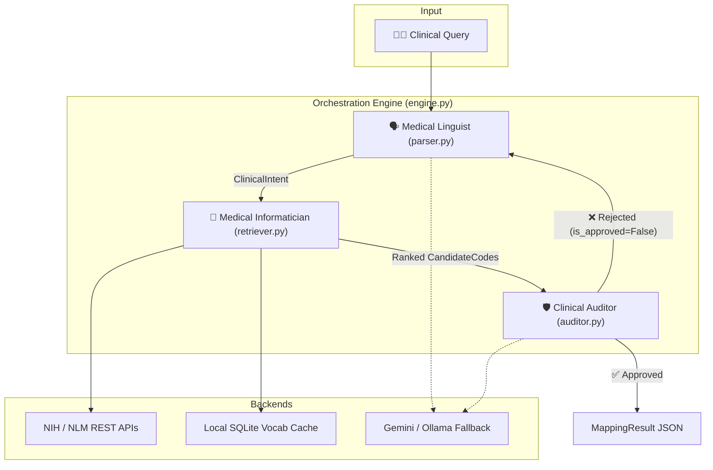

# Clinical Cohort Mapper: Design & Reasoning Write-up

This document provides a comprehensive technical write-up of the **Consensus-Driven Graph Reflexion (CDGR)** architecture, detailed analysis of system performance, cost, and robustness, diagnostics on scaling to 3M+ records, and an enterprise production engineering roadmap.

---

## 1. Core Architecture: Consensus-Driven Graph Reflexion (CDGR)

Standard clinical text parsers rely on single-pass heuristic keyword extraction or direct LLM mappings. These approaches fail in clinical environments due to semantic "hallucinations," vocabulary boundary violations (e.g., mixing LOINC with ICD-10), and a lack of clinical specificity (e.g., selecting an "unspecified" parent code instead of a highly specific clinical stage).

The **CDGR architecture** solves this by establishing a multi-agent consensus network governed by a directed graph state machine.



### Component Breakdown
1. **Medical Linguist (Parser)**: Converts unstructured text into a structured, grammar-enforced `ClinicalIntent` (Pydantic model) containing domains, entities, constraints, and negative constraints.
2. **Medical Informatician (Retriever)**: Queries public vocabulary APIs and local databases, performs class expansion (e.g., resolving GLP-1 agonists to active ingredients), and applies a deterministic scoring function.
3. **Clinical Auditor (Critic)**: Serves as a clinical validator. If a code violates query constraints, the Auditor rejects the concept, generating exclusion parameters and triggering a retry.

---

## 2. In-Depth Step-by-Step Flow

### A. Intent Parsing & Synonym Expansion
*   **Parsing**: We use a two-stage parsing approach. The first pass applies regular expressions to capture trivial constraints (e.g. `> 7%`). The second pass calls the LLM in structured JSON mode to map concepts, synonyms, and negative constraints.
*   **Synonym Resolution**: Synonyms are resolved using:
    1.  *Rule-Based Mapping*: Hardcoded lookup for common acronyms (`HbA1c` $\rightarrow$ `Hemoglobin A1c`, `T2D` $\rightarrow$ `Type 2 Diabetes`).
    2.  *Ontology Cache*: Querying local SQLite tables to expand synonyms like `renal failure` $\rightarrow$ `kidney disease`.
    3.  *Approximate API Matching*: Querying the NIH RxNorm API for medication brand-to-generic conversions.

### B. Terminology Retrieval & Deterministic Ranking
Candidates are fetched from LOINC, ICD-10-CM, RxNorm, and local SNOMED subsets. Once fetched, the Informatician calculates a deterministic relevance score:

$$\text{Score} = \text{Auditor Selection Boost} (200) + \text{Domain Match} (20) + \text{Entity Match} (15\text{-}25) + \text{Synonym Match} (8\text{-}13) + \text{Specificity Match} (15) - \text{API Rank Decay} (0.5 \times \text{rank})$$

This prevents the system from relying purely on LLM sorting, which is prone to recency bias and hallucinations.

### C. Self-Correction Reflexion Loop
If the Auditor finds a candidate that represents a device (e.g. "HbA1c Measurement Device") rather than an analyte, or an unspecified parent category (e.g., `N18.9` for CKD) when specific stages were requested, it:
1.  Sets `is_approved = False`.
2.  Appends the incorrect concept codes or keywords to `suggested_exclusions`.
3.  Injects a clinical critique explaining why the selection failed.
The LangGraph engine routes the state back to the Linguist, which parses the query again with `negative_constraints` configured, forcing the retriever to fetch alternative, specific codes.

---

## 3. Performance, Cost & Robustness Profile

Below is a detailed diagnostic matrix of the current prototype.

| Metric | Current Prototype Profile | Primary Bottlenecks | Production Recommendations |
| :--- | :--- | :--- | :--- |
| **Latency** | **Single-Pass**: 7 – 10 seconds<br/>**Self-Correction**: 20 – 35 seconds | Synchronous external network calls (`urllib.request`) and sequential LLM inference times. | • Implement local vocabulary caches.<br/>• Use asynchronous parallel processing.<br/>• Set up Redis semantic caching. |
| **Cost** | **~$0.001 – $0.003** per query (~5k input/output tokens total). | Tokens scale linearly with the number of candidate codes audited and self-correction iterations. | • Fine-tune an on-premise local model (e.g., Llama-3-8B).<br/>• Eliminate LLM calls entirely for cached matches. |
| **Robustness** | **High precision** for complex criteria.<br/>**Low robustness** on external outages and small fallback models. | Dependency on NIH/NLM REST APIs. Fallback to `qwen3:0.6b` fails structured parsing tasks. | • Host vocabularies locally (no external APIs).<br/>• Use larger local fallbacks (e.g., Llama-3-70B).<br/>• Human-in-the-Loop review queue. |

---

## 4. Scalability Analysis: 3M+ Record Scenario

If the database is scaled to **3 million records** (e.g., full UMLS Metathesaurus or OHDSI OMOP vocabulary containing LOINC, SNOMED, and ICD-10), the current implementation fails to scale.

### A. SQLite Lexical Search Bottlenecks
*   **The Issue**: The prototype database queries use string matching:
    ```sql
    SELECT * FROM local_concepts WHERE LOWER(display) LIKE '%term%'
    ```
    With 3 million records, SQL `LIKE '%term%'` patterns prevent the use of standard indexes, forcing database engine full-table scans. A single lookup would take several seconds, locking the thread.
*   **The Solution**: Upgrade to **SQLite FTS5 (Full-Text Search)** virtual tables. This indexes words into tokens, changing the lookup complexity from $O(N)$ scans to $O(\log N)$ indexed lookups. Alternatively, migrate to **Elasticsearch** or **PostgreSQL** with GIN indexes (`pg_trgm`).

### B. In-Memory Python Scoring Bottlenecks
*   **The Issue**: The `_rank_candidates` function loops over all candidate codes returned and applies text matches in Python:
    ```python
    for c in candidates:
        if ent_lower in c.display.lower():
            score += 15.0
    ```
    If the retriever fetches hundreds of thousands of candidate codes, this loop will block the CPU. Storing 3M `CandidateCode` Pydantic objects in RAM consumes gigabytes of memory, risking Out-Of-Memory (OOM) crashes.
*   **The Solution**:
    1.  **Database Pre-Filtering**: Restrict the search scope directly in the database using `WHERE` clauses (e.g., filtering by vocabulary name or domain code) to prune the search space.
    2.  **Top-K Retrieval**: Ensure the database query limits returns to a maximum of 100–200 candidates. Do not pull millions of records into memory for sorting.
    3.  **Push Down Scoring**: Shift basic scoring factors (e.g., exact matches and synonym weights) directly into the database engine using ranking score functions (such as BM25 in Elasticsearch or `ts_rank` in Postgres).

### C. Graph Traversal Bottlenecks
*   **The Issue**: Iteratively traversing multi-level hierarchical concepts (parent/child/ancestor paths) in Python using single-step SQL queries creates high database round-trip overhead.
*   **The Solution**: Write **recursive SQL Common Table Expressions (CTEs)** to resolve paths in a single query execution, or migrate to a graph-native store like **Neo4j**.

---

## 5. Production Engineering Roadmap

To transition this prototype into a production-grade, enterprise-scale clinical cohort mapper, we recommend the following five-stage roadmap:

```
  Stage 1: Local Ingestion ──► Stage 2: Database Search ──► Stage 3: Async & Cache ──► Stage 4: Local LLM ──► Stage 5: CITL Review
```

### Stage 1: Local Terminology Cluster
*   Ingest standard OMOP/Athena vocabularies entirely into a local database cluster (e.g., PostgreSQL or Elasticsearch).
*   Eliminate external NIH and NLM REST API dependencies.

### Stage 2: Database-Level Retrieval & Scoring
*   Implement full-text search indexes (PostgreSQL GIN or Elasticsearch BM25) and push text-scoring weights into the query.
*   Enforce `LIMIT 100` on the database query before objects are parsed into Pydantic models.

### Stage 3: Asynchronous Orchestration & Caching
*   Refactor the LangGraph workflows and database connect sessions using Python's `asyncio` to allow concurrent execution of thousands of streams.
*   Implement a **Redis Semantic Cache** mapping search queries to historical approved mappings to bypass LLM execution entirely for recurring queries (e.g., "Patients on Metformin").

### Stage 4: Self-Hosted LLMs
*   Replace external Gemini API dependencies with local, self-hosted LLM instances (e.g., Llama-3-8B-Instruct or Llama-3-70B-Instruct).
*   Fine-tune the local parser and auditor models using synthetic mapping datasets, keeping clinical data secure on-premise and eliminating API token costs.

### Stage 5: Clinician-in-the-Loop (CITL) UI
*   Build a monitoring dashboard that visualizes active queries, candidate mappings, and telemetry traces.
*   Route mappings with low confidence scores ($<0.85$) to a manual clinician review queue for override, feeding decisions back to improve the model.
