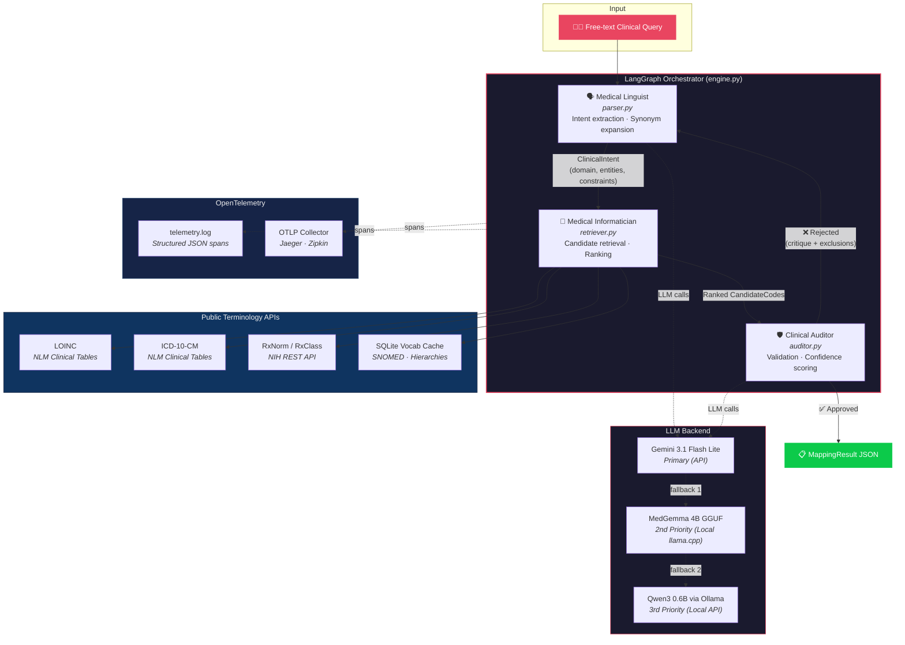

# Architecture & The CDGR Pipeline

The Clinical Cohort Query Mapper uses a self-correcting **Consensus-Driven Graph Reflexion (CDGR)** pipeline to translate natural language queries to high-precision medical concept codes.



---

## Reflexion Loop Detail

```mermaid
sequenceDiagram
    participant User
    participant Engine as Orchestrator
    participant Parser as Medical Linguist
    participant Retriever as Medical Informatician
    participant Auditor as Clinical Auditor
    participant API as Public APIs

    User->>Engine: "Patients with CKD stage 3"
    
    rect rgb(26, 26, 46)
    Note over Engine: Attempt 1
    Engine->>Parser: Parse query
    Parser-->>Engine: domain=condition, entity=CKD stage 3
    Engine->>Retriever: Retrieve candidates
    Retriever->>API: Query ICD-10-CM
    API-->>Retriever: N18.9 (unspecified), N18.30, N18.31, N18.32
    Retriever-->>Engine: Ranked candidates
    Engine->>Auditor: Audit candidates
    Auditor-->>Engine: ❌ REJECT N18.9 — too broad for "stage 3"
    end

    rect rgb(15, 52, 96)
    Note over Engine: Attempt 2 (Self-Correction)
    Engine->>Parser: Re-parse with critique (exclude N18.9)
    Parser-->>Engine: Refined intent + exclusion rules
    Engine->>Retriever: Retrieve with exclusions
    Retriever->>API: Query children of N18
    API-->>Retriever: N18.30, N18.31, N18.32
    Retriever-->>Engine: Filtered candidates
    Engine->>Auditor: Re-audit
    Auditor-->>Engine: ✅ APPROVED — stage-specific codes
    end

    Engine-->>User: MappingResult JSON (N18.30, N18.31, N18.32)
```



---

## Agent Specifications

### 1. Medical Linguist (Extraction & Expansion)
- **Role**: Deconstruct the free-form query into standard clinical components and expand terminology.
- **Input**: Natural language query + (Optional) critique from the Auditor on retry.
- **Output**: Structured JSON following the Pydantic schema below:
    ```python
    class ClinicalIntent(BaseModel):
        original_query: str
        clinical_entities: List[str]      # e.g., ["HbA1c", "glycated hemoglobin"]
        synonyms: List[str]               # Expanded terms
        domain: Literal["measurement", "condition", "drug", "procedure", "observation"]
        constraint: Optional[Constraint]  # operator, value, unit
        status: Literal["current", "prior", "any"]
        negative_constraints: List[str]   # Terms/codes to explicitly avoid (populated on retry)
    ```
- **Parsing Design**: Uses a two-stage parsing approach. The first pass applies regular expressions to capture trivial constraints (e.g. `> 7%`). The second pass calls the LLM in structured JSON mode to map concepts, synonyms, and negative constraints.

### 2. Medical Informatician (Hybrid Retrieval)
- **Role**: Map the parsed entities and synonyms to standard terminology candidate pools.
- **Search Mechanics**:
  1. **Lexical (FTS5 / BM25)**: Query local SQLite vocabulary database for exact display and synonym matches.
  2. **Vector Search / conceptual matching**: Captures conceptual equivalents (e.g., "kidney failure" $\rightarrow$ "renal failure").
  3. **External APIs**: Query RxNav API (for RxNorm drug hierarchies) and LOINC/UMLS UTS REST APIs for real-time validation.

### 3. Clinical Auditor (Ontology Reflexion & Critic)
- **Role**: Evaluate candidates, traverse relationship graphs, and either approve or reject the candidate pool.
- **Ontology Reflexion Heuristics**:
  - **Domain Validation**: Ensure candidates match the target vocabulary (LOINC for measurements, RxNorm for drugs, ICD-10-CM/SNOMED for conditions).
  - **Hierarchical Expansion**:
    - Retrieve parent concepts of the candidate. If the query specified details not present in the parent (e.g., "stage 3" is in the query, but candidate parent is "unspecified CKD" `N18.9`), flag it.
    - Query child and sibling concepts. Compare their names against the query. If a modifier (e.g., "stage 3a" `N18.31` vs "stage 3b` `N18.32`), include both and mark them as specific targets.
  - **Decision Threshold**:
    - *If approved*: Ranks candidates, calculating a weighted confidence score.
    - *If rejected*: Return a structured rejection critique (e.g., `{"status": "rejected", "reason": "Candidate E11 is a Condition but domain is Measurement", "suggested_exclusions": ["diabetes mellitus"]}`).
  - **Loop Termination**: Enforces a max retry limit (default 3). If no consensus is reached, it returns the highest-scoring candidate with a metadata flag `unverified_by_auditor = true` and logs a warning.

---

## Terminology Retrieval & Deterministic Ranking

Candidates are fetched from LOINC, ICD-10-CM, RxNorm, and local SNOMED subsets. Once fetched, the Informatician calculates a deterministic relevance score using the following formula:

$$\text{Score} = \text{Auditor Selection Boost} (200) + \text{Domain Match} (20) + \text{Entity Match} (15\text{-}25) + \text{Synonym Match} (8\text{-}13) + \text{Specificity Match} (15) - \text{API Rank Decay} (0.5 \times \text{rank})$$

This scoring formula guarantees that the system is deterministic, reproducible, and prevents relying purely on LLM sorting, which is prone to recency bias and hallucinations.
